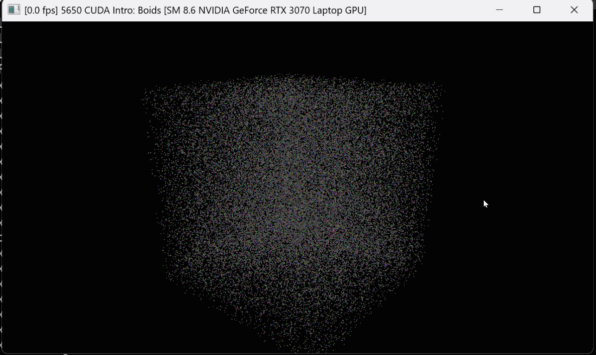

**University of Pennsylvania, CIS 5650: GPU Programming and Architecture,
Project 1 - Flocking**

* Rayyan Shaik
  * [LinkedIn](https://www.linkedin.com/in/rayyan-shaik)
* Tested on: Windows 11, AMD Ryzen 7 5700H @ 3.3GHz 32GB, Mobile RTX 3070 (Personal Computer)

## 3D Boids Simulation

_50,000 boids simulated with `dt=0.2`_

## Overview

This project is a CUDA implementation and visualization of the _Boids Flocking Algorithm_ in 3D. Particles, "boids", are updated using three principle rules of cohesion, separation, and alignment. I implemented 3 different techniques to apply these rules to each boid.
  1. __Naive__: Each boid (each computed by an independent CUDA thread) checks every other boid when computing its velocity update. 
  2. __Scattered Uniform Grid__: The 3D space is split up into a grid of uniform cells and each boid is assigned a cell. Grid cell indices paired with mappings to each boid are sorted so that all boids within a cell can be easily determined. Boids (each computed by an independent CUDA thread) need only search for other boids in their cell and immediate neighbors.
  3. __Coherent Uniform Grid__: On top of the scattered uniform grid approach, boid position and velocities are also reordered by cell to improve memory locality.

## Performance Analysis

### Timing Methodology
Framerate or frames per second (FPS) is defined as the total number of frames divided by elapsed time. Framerate is recorded over a 15 second period after a 5 second warmup (i.e. the first 5 seconds since the programs startup are not included).

### 1. Number of Boids vs. Framerate
#### Visualization On

#### Visualization Off

#### Analysis
The number of boids on the x-axis of both charts are log-scaled. From the charts, it is clear to see that naive implementation has the poorest overall performance, and experiences a sharp decline in application performance as the number of boids increase. Both uniform-grid approachs strongly outperform naive implemenation when the number of boids is greater than ~2,000. Their performance is also fairly stable for less than 25,000 boids. After that threshold, it becomes much more apparent that the coherent memory approach outperforms the scattered one for large numbers of boids. 

Importantly, as the number of boids grows very large (~250,000) both uniform-grid approaches are still able to run the simulation at a "visually coherent" framerate, whereas the naive approach ouputs ~1 fps. The number of computations in the niave approach grows quadratically with the number of boids as each boid must check every other boid. When utilizing a uniform-grid that is still true in the worst case (if the majority of boids are somehow within the same cell), but in practice is reduced significantly.  Furthermore it was expected that coherent memory approach outperforms the scattered uniform-grid approach as it benefits from the same reduced "checks" each boid has to make against other boids, while also benefiting from memory locality, reducing scattered memory access for boid positions and velocities.

### 2. Cuda Block Size & Block Count vs. Framerate

Block count is computed as `ceil(N / block size)`.
In this analysis, `N=20000`. I.e. 20,000 boids were simulated. 

#### Analysis
For each implementation it appears that changing the block count had marginal effects on the performance of the application (fps). For both uniform-grid approaches `Block Size = 32` was optimal, though block sizes ranges from `[32,128]` performed nearly identically. The naive approach was slighly more sensitive to block size and `Block Size = 256` performed the best. This suggests that the naive implementation is more sensitive to block size because each thread performs a relatively large amount of work, looping over all other boids. Different block sizes can change how effectively the GPU can schedule threads and hide execution or memory latency. In these measurements, a block size of 256 provided the best balance for the naive kernel.

### 3. Cell Width Comparison -- 8 cells vs 27 cells
**Constants:** 200,000 boids, block size 128, visualization disabled.

| Cell Width | Neighbor Cells Checked | Coherent FPS |
|---|---:|---:|
| `2R` | 8 | 779.4 |
| `R` | 27 | 1009.9 |

The FPS measured for each cell width/neighboring cells checked was an average of 5 runs using the same timings & methodology used for previous analysis.

#### Analysis
The data shows that using `Cell Width = R` and `Neighboring Cells Checked = 27` saw an improvemnet of ~`29.5%` and ~`230 fps` - which is a significant performance boost. The "expensive" part of the uniform grid approach is processings the boids inside each cell. 

Using `Cell Width = R` and checking 27 neighboring cells improved performance from `779.4 FPS` to `1009.9 FPS`, an increase of approximately `29.6%` (~`230 FPS`).

Although the 27-cell approach checks more grid cells, the cells themselves are much smaller. In 3D, reducing the cell width from `2R` to `R` reduces each cell's volume by a factor of 8. As a result, the 27-cell search considers a smaller total volume than the 8-cell search, so fewer boids are processed on average.

The expensive part of the uniform-grid neighbor search isn't accessing a cell's start/end indices, but iterating through the boids contained in those cells and performing position loads, distance calculations, and rule checks; the reduction in candidate boids outweighs the overhead of checking more grid cells, resulting in higher FPS.